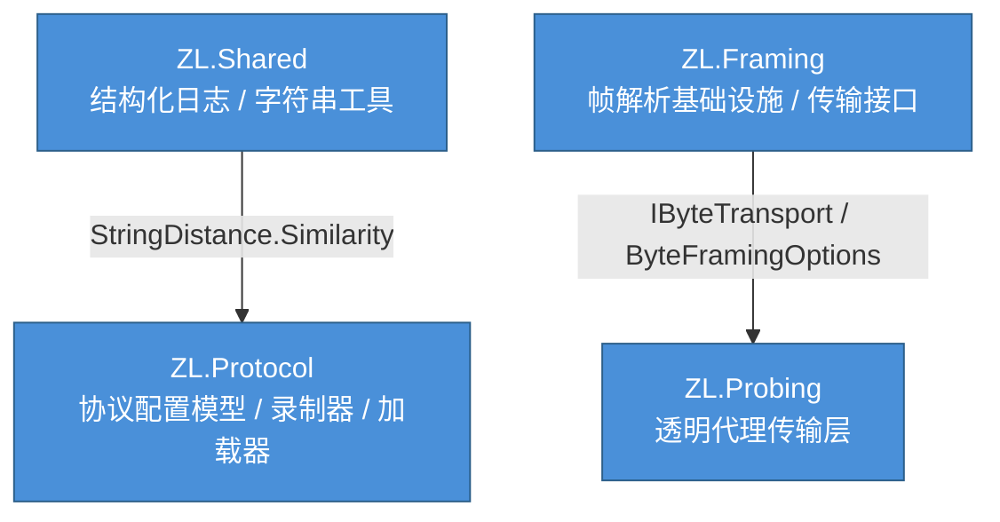
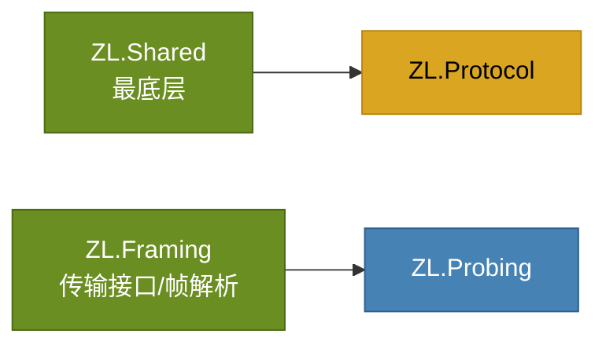
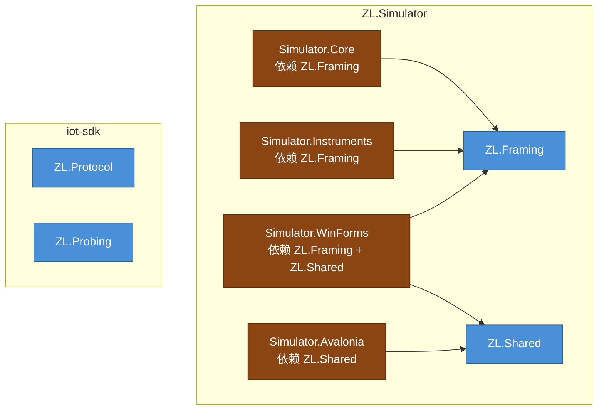
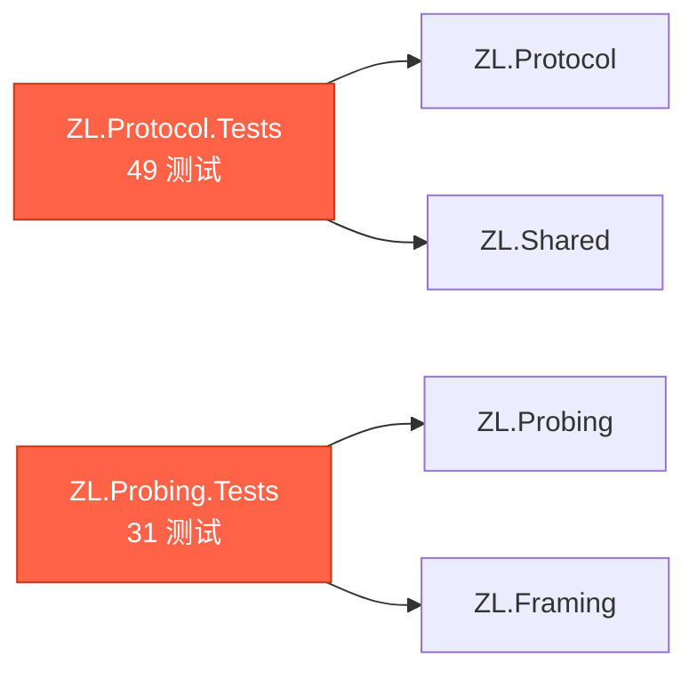

# 依赖关系图 — ZL.Foundation

本文档描述 ZL.Foundation 四个组件之间的依赖关系，以及与外部项目的引用关系。

---

## 1. ZL.Foundation 内部依赖图



**依赖方向**: `ZL.Shared` ← `ZL.Protocol`，`ZL.Framing` ← `ZL.Probing`

---

## 2. 完整依赖链



---

## 3. 各组件依赖详情

### 3.1 ZL.Shared（无依赖）

```
ZL.Shared
  └─ 依赖: 无
  └─ 被依赖: ZL.Protocol
```

| 类型 | 说明 |
|---|---|
| `StructuredLog` | 基于 Serilog 的结构化日志门面 |
| `LogBootstrapOptions` | 日志初始化配置 |
| `LogEventMetadata` | 日志事件元数据 |
| `StringDistance` | Levenshtein 编辑距离工具 |

### 3.2 ZL.Protocol（依赖 ZL.Shared）

```
ZL.Protocol
  ├─ 依赖: ZL.Shared (StringDistance.Similarity)
  ├─ 被依赖: 无（目前）
  └─ 命名空间: ZL.Protocol, ZL.Protocol.Models
```

| 类型 | 说明 |
|---|---|
| `ProtocolConfig` | 协议配置根对象 |
| `CommandDefinition` | 命令定义 |
| `EventDefinition` | 事件定义 |
| `ResponseParserDefinition` | 响应解析器 |
| `ReadStrategyDefinition` | 读取策略 |
| `ValidationRule` | 校验规则 |
| `ConditionalResponse` | 条件响应 |
| `SimulationTagConfig` | 仿真标签配置 |
| `ProtocolRecorder` | 从日志学习协议 |
| `ProtocolConfigLoader` | JSON 解析/加载 |

### 3.3 ZL.Framing（无依赖）

```
ZL.Framing
  ├─ 依赖: 无
  ├─ 被依赖: ZL.Probing
  └─ 命名空间: ZL.Framing
```

| 类型 | 说明 |
|---|---|
| `IByteTransport` | 基础传输接口 |
| `ISessionByteTransport` | 带会话的数据事件 |
| `ISessionSendByteTransport` | 带会话的发送 |
| `ISessionLifecycleTransport` | 会话生命周期 |
| `ByteFramingOptions` | 帧分割配置 |
| `FrameAssembler` | 字节流→帧组装 |
| `FrameStatus` | 帧状态 |
| `FrameSplitMode` | 帧分割模式枚举 |
| `IFrameDecoder` | 帧解码器接口 |
| `LengthFieldFrameDecoder` | 长度字段解码器 |
| `FixedLengthFrameDecoder` | 定长解码器 |
| `StickyWindowBuffer` | 字节缓冲区 |
| `ChecksumUtil` | 校验和工具 |
| `FramingHex` | 十六进制工具 |

### 3.4 ZL.Probing（依赖 ZL.Framing）

```
ZL.Probing
  ├─ 依赖: ZL.Framing (IByteTransport / ByteFramingOptions / FrameAssembler)
  ├─ 被依赖: 无（目前）
  └─ 命名空间: ZL.Probing
```

| 类型 | 说明 |
|---|---|
| `TransparentProxyTransport` | 透明代理传输 |
| `TransparentProxyConfig` | 代理配置 |
| `ListenMode` | 监听模式枚举 (TcpServer/TcpClient/Serial) |

---

## 4. 与 ZL.Simulator 的引用关系



### 4.1 ZL.Simulator 中的重复代码

| 组件 | ZL.Simulator 位置 | iot-sdk 位置 | 一致性 |
|---|---|---|---|
| ByteFramingOptions | `ZL.Framing/Core/ByteFramingOptions.cs` | `ZL.Framing/Core/ByteFramingOptions.cs` | 100% |
| FrameAssembler | `ZL.Framing/Core/FrameAssembler.cs` | `ZL.Framing/Core/FrameAssembler.cs` | 100% |
| IByteTransport 接口族 | `Simulator.Core/Transports/` | `ZL.Framing/Core/` | 100% |
| ProtocolConfig | `Simulator.Core/Protocols/` | `ZL.Protocol/Models/` | 基本一致 |
| TransparentProxyTransport | `Simulator.Instruments/Probing/` | `ZL.Probing/` | 接口一致 |
| StringDistance | `ZL.Shared/Utils/` | `ZL.Shared/Utils/` | 一致 |

---

## 5. 测试项目依赖



---

## 6. 完整的依赖矩阵

| 组件 | 依赖 | 被依赖 | 测试数 |
|---|---|---|---|
| ZL.Shared | 无 | ZL.Protocol | — |
| ZL.Protocol | ZL.Shared | 无 | 49 |
| ZL.Framing | 无 | ZL.Probing | — |
| ZL.Probing | ZL.Framing | 无 | 31 |

**总计**: 80 个测试，0 失败，0 跳过。
