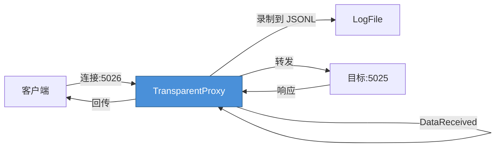

# ZL.Probing — 透明代理传输层

## 概述

ZL.Probing 提供透明代理传输能力，支持 TCP Server/TCP Client/Serial 三种监听模式，用于流量录制和转发。从 ZL.Simulator 的 `Simulator.Instruments.Probing.TransparentProxyTransport` 提取而来。

**命名空间**: `ZL.Probing`

**依赖**: ZL.Framing（`IByteTransport`、`ByteFramingOptions`、`FrameAssembler`）

**测试覆盖**: 31 个测试，0 失败

---

## 1. 类型一览

| 类型 | 说明 |
|---|---|
| `TransparentProxyTransport` | 透明代理传输实现 |
| `TransparentProxyConfig` | 代理配置 |
| `ListenMode` | 监听模式枚举 |

---

## 2. TransparentProxyTransport

### 2.1 类型签名

```csharp
public sealed class TransparentProxyTransport
    : IByteTransport, ISessionByteTransport,
      ISessionSendByteTransport, ISessionLifecycleTransport, IDisposable
{
    // 构造函数
    public TransparentProxyTransport(TransparentProxyConfig config, IByteTransport targetTransport);
    
    // 只读属性
    public string ResourceName { get; }
    public bool IsOpen { get; }
    public int FrameTimeoutMs { get; }
    public ByteFramingOptions Framing { get; }
    
    // 事件
    public event Action<byte[]?>? DataReceived;
    public event Action<byte[]?, string>? DataReceivedSession;
    public event Action<FrameStatus>? FrameStatusChanged;
    public event Action<string>? SessionStarted;
    public event Action<string>? SessionEnded;
    
    // 生命周期
    public void Open();
    public void Close();
    public void Dispose();
    
    // 发送
    public void Send(byte[]? data);
    public void Send(byte[]? data, string sessionId);
}
```

### 2.2 接口实现

| 接口 | 实现的内容 |
|---|---|
| `IByteTransport` | `ResourceName`、`IsOpen`、`Open()`、`Close()`、`Send(data)`、`DataReceived`、`FrameStatusChanged` |
| `ISessionByteTransport` | `DataReceivedSession` |
| `ISessionSendByteTransport` | `Send(data, sessionId)` |
| `ISessionLifecycleTransport` | `SessionStarted`、`SessionEnded` |

### 2.3 ResourceName 格式

格式：`Proxy:{源端口}->{目标主机}:{目标端口}`

示例：`Proxy:5026->localhost:5025`

---

## 3. TransparentProxyConfig

### 3.1 类型签名

```csharp
public sealed class TransparentProxyConfig
{
    public ListenMode ListenMode { get; set; }           // 默认 ListenMode.TcpServer
    public int? SourcePort { get; set; }                 // 本地监听端口（TCP Server 模式）
    public string? SourcePortName { get; set; }          // 本地监听串口名（Serial 模式）
    public string? TargetHost { get; set; }              // 默认 "localhost"
    public int? TargetPort { get; set; }                 // 目标端口
    public string? TargetPortName { get; set; }          // 目标串口名
    public bool SnifferOnly { get; set; }               // 默认 false
    public string? LogFile { get; set; }                 // JSONL 格式
    public string? SessionLogDir { get; set; }           // 会话日志目录
    public string? EncodingName { get; set; }            // 默认 "UTF-8"
    public int FrameTimeoutMs { get; set; }              // 默认 30
    public ByteFramingOptions? ByteFraming { get; set; } // 帧选项配置
}
```

### 3.2 配置说明

| 属性 | 说明 | 示例值 |
|---|---|---|
| `ListenMode` | 监听模式 | `TcpServer` / `TcpClient` / `Serial` |
| `SourcePort` | 本地监听端口 | `5026` |
| `SourcePortName` | 本地串口名 | `"/dev/ttyS1"` |
| `TargetHost` | 目标主机 | `"localhost"` |
| `TargetPort` | 目标端口 | `5025` |
| `TargetPortName` | 目标串口名 | `"/dev/ttyUSB0"` |
| `SnifferOnly` | 只侦听不转发 | `true` / `false` |
| `LogFile` | 主日志文件 | `"capture.jsonl"` |
| `SessionLogDir` | 会话日志目录 | `"sessions/"` |
| `EncodingName` | 文本编码 | `"UTF-8"` / `"GB2312"` |
| `FrameTimeoutMs` | 帧超时 | `30`（毫秒） |

---

## 4. ListenMode 枚举

```csharp
public enum ListenMode
{
    TcpServer,   // TCP 服务器模式：监听端口，接受客户端连接
    TcpClient,   // TCP 客户端模式：连接到目标服务器
    Serial       // Serial 监听模式：监听串口
}
```

---

## 5. 三种监听模式

### 5.1 TCP Server 模式

```csharp
var config = new TransparentProxyConfig
{
    ListenMode = ListenMode.TcpServer,
    SourcePort = 5026,                // 监听本地 5026
    TargetHost = "localhost",         // 转发到 localhost
    TargetPort = 5025                 // 目标端口 5025
};
```

工作流程：
1. `Open()` 时启动 TCP 监听（SourcePort）
2. 客户端连接到 SourcePort
3. 代理接受连接，创建会话
4. 客户端→代理的流量转发到 TargetHost:TargetPort
5. TargetHost:TargetPort→代理的流量回传给客户端

### 5.2 TCP Client 模式

```csharp
var config = new TransparentProxyConfig
{
    ListenMode = ListenMode.TcpClient,
    SourcePort = 5026,                // 本地监听
    TargetHost = "192.168.1.100",    // 目标 IP
    TargetPort = 5025
};
```

工作流程：
1. `Open()` 时监听 SourcePort
2. 客户端连接到 SourcePort
3. 代理连接到 TargetHost:TargetPort
4. 双向透明转发

### 5.3 Serial 模式

```csharp
var config = new TransparentProxyConfig
{
    ListenMode = ListenMode.Serial,
    SourcePortName = "/dev/ttyS1",    // 监听串口
    TargetPortName = "/dev/ttyUSB0"   // 目标串口
};
```

---

## 6. SnifferOnly 模式

```csharp
var config = new TransparentProxyConfig
{
    ListenMode = ListenMode.TcpServer,
    SourcePort = 5026,
    TargetHost = "localhost",
    TargetPort = 5025,
    SnifferOnly = true  // 只录制，不转发
};
```

当 `SnifferOnly = true` 时：
- 代理接受客户端连接并接收数据
- 数据**不**转发到目标传输
- 所有流量自动记录到 `LogFile`
- 每个会话的日志记录到 `SessionLogDir`

这是协议录制的典型配置。

---

## 7. 生命周期

```csharp
var targetTransport = new TcpByteTransport(5025, 30, new ByteFramingOptions());
var proxy = new TransparentProxyTransport(config, targetTransport);

// 1. 注册事件
proxy.DataReceived += data => Console.WriteLine($"收到 {data?.Length} 字节");
proxy.SessionStarted += id => Console.WriteLine($"会话: {id}");
proxy.SessionEnded += id => Console.WriteLine($"会话结束: {id}");

// 2. 打开
proxy.Open();
// → 初始化 CancellationTokenSource
// → 打开 targetTransport
// → 订阅 targetTransport 事件
// → 启动 ListenLoopAsync 后台任务（TcpServer 模式）
// → _isOpen = true

// 3. 使用...
proxy.Send(Encoding.UTF8.GetBytes("VOLT?"));

// 4. 关闭
proxy.Close();
// → 完成日志队列
// → 取消 token
// → 清理所有会话
// → 关闭所有 writer
// → 取消订阅 target 事件
// → 关闭 targetTransport
// → 停止 framer
// → _isOpen = false

// 5. 释放
proxy.Dispose();
// → 额外释放 framer
```

---

## 8. 数据流程



**数据包方向标记**:
- `ClientToProxy` — 客户端→代理
- `TargetToProxy` — 目标→代理

**数据包日志格式**:
```json
{
  "Timestamp": "2024-01-01T10:00:00Z",
  "Direction": "ClientToProxy",
  "SessionId": "sess_001",
  "Length": 5,
  "Hex": "564F4C5420",
  "Text": "VOLT "
}
```

---

## 9. 内部实现细节

### 会话管理

```csharp
// 私有嵌套类 SessionState
private sealed class SessionState
{
    public string SessionId { get; set; }
    public TcpClient Client { get; set; }
    public FrameAssembler Framer { get; set; }
}
```

### 日志队列

```csharp
// 私有字段
private BlockingCollection<PacketLog> _logQueue;
```

使用 `BlockingCollection` 实现线程安全的异步日志写入。

### 资源清理

`Close()` 方法的清理顺序：
1. 完成日志队列（`_logQueue.CompleteAdding()`）
2. 取消 token（`_cts.Cancel()`）
3. 清理所有 session（`_sessions.Clear()`）
4. 关闭所有 writer
5. 取消订阅目标事件
6. 关闭目标传输（`_targetTransport.Close()`）
7. 停止帧组装器（`_framer.Stop()`）
8. 设置 `_isOpen = false`

---

## 10. 测试覆盖

**测试项目**: `tests/ZL.Probing.Tests/`（31 个测试）

| 测试文件 | 测试数 | 覆盖范围 |
|---|---|---|
| `TransparentProxyConfigTests.cs` | 11 | 配置默认值、三种监听模式、日志路径、编码、超时 |
| `TransparentProxyTransportTests.cs` | 20 | 构造函数验证、生命周期、Send 语义、SnifferOnly、事件注册 |
