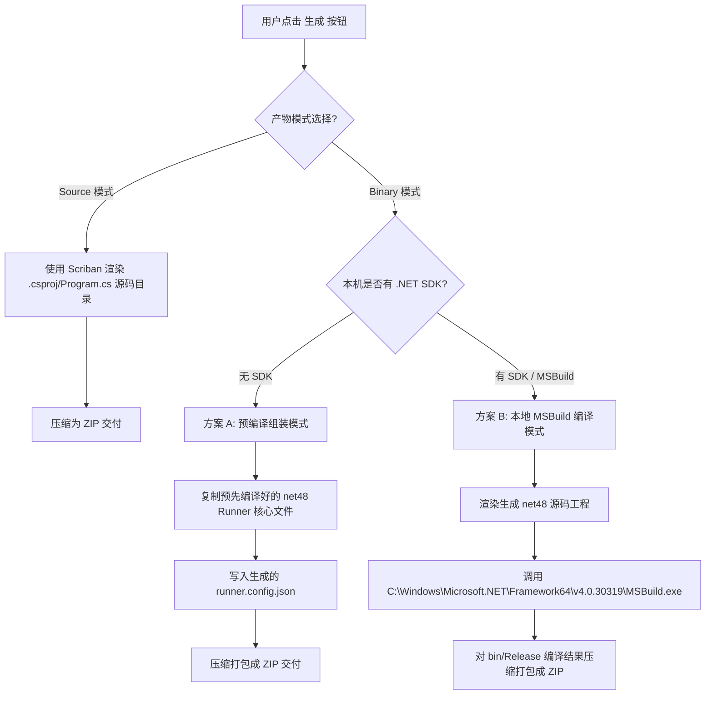

# ZL.Iot.Runner.Desktop 独立桌面端生成器与极简 Runner 方案 v4

> **版本**: 4.0
> **日期**: 2026-06-29
> **状态**: 待评审
> **核心原则**: 
> 1. **零安装负担**：生成器本身及生成的 Runner 产物均基于 **.NET Framework 4.8**。在 Windows 10/11 电脑上解压即可双击直接运行，**免去用户安装 .NET Core 运行时的麻烦**。
> 2. **极简架构（瑞士军刀）**：彻底剔除重型队列与复杂并发机制（如 JobScheduler/JobStore），使用极简的“配置加载器 + 驱动执行器（复用早期 ZL.Runtime 雏形）”。
> 3. **最大化复用**：桌面端 UI 深度复用 `IotDebug` 已验证的 `UcTagTable`（点表管理）、`UcConnectionPanel`（连接面板）等核心控件。
> 4. **一体化集成**：立即考虑并集成 `ZL.DataSync`，将其降级改造为支持 `netstandard2.0`，使极简 Runner 具备开箱即用的本地缓存和同步推送能力。

---

## 一、方案本质与架构对比

传统的 Web 端和 `ZL.Iot.Runner` 是基于 .NET 8.0/10.0 构建的，依赖庞大且复杂的调度、事务队列和监控服务，要求目标主机必须安装有相应的 .NET Core 运行时。

为了达成**免安装运行时**的诉求，v4 方案的核心是**双端全面降级至 .NET 4.8 兼容链路**：
- **桌面生成器**：.NET Framework 4.8 WinForms 程序，直接调用 Generator 模板逻辑，渲染代码、写入配置、组装产物。
- **生成的 Runner 目标程序**：.NET Framework 4.8 极简控制台/WinForms 程序，仅依赖 `ZL.IotHub`（支持 netstandard2.0）与改造后的 `ZL.DataSync`（支持 netstandard2.0），通过系统内置的 MSBuild 编译，或使用生成器自带的预编译二进制包直接拼装。

### 架构演进对比

```mermaid
graph TD
    subgraph 传统 Web 重型架构 (net8.0)
        WebUI[Web UI 页面] -->|队列机制/GenerateJob| JobScheduler[Job 调度器]
        JobScheduler -->|调用编译引擎| ProjectGenerator[编译及打包引擎]
        ProjectGenerator -->|生成 net8.0 Runner| RunnerNet8[Runner 产物 net8.0]
        RunnerNet8 -->|需要安装| NetCoreRuntime[Windows .NET Core Runtime]
    end

    subgraph 独立桌面端架构 v4 (net48/netstandard2.0)
        GeneratorUI[桌面生成器 WinForm net48] -->|本地直调| SimpleGenerator[极简生成器]
        UcTagTable[UcTagTable 控件] -->|加载 CSV/XML/JSON 点表| GeneratorUI
        SimpleGenerator -->|方案 A: 预编译组装| ZipA[秒级打包解压即用 .net48]
        SimpleGenerator -->|方案 B: 本地 MSBuild 编译| ZipB[编译生成产物 .net48]
        ZipA -->|免安装运行时| Windows48[Windows OS 自带 .NET 4.8 环镜]
        ZipB -->|免安装运行时| Windows48
    end
```

---

## 二、极简 Runner 执行器（模板）架构

彻底弃用 `ZL.Iot.Runner` 和 `ZL.Biz.Execute` 的庞大依赖，根据 `/Users/dingyuwang/0-X/iot-sdk/docs/参考/Zl.Service/ZL.Runtime` 的执行器雏形，为生成的 Runner 模板（Console 和 WinForm）重新编写极简 the 加载与执行逻辑。

### 2.1 极简 Runner 核心逻辑
生成的 `Program.cs` 仅包含两个主要行为：
1. **加载器 (Loader)**：使用 `System.Text.Json` 反序列化 `runner.config.json`，提取设备和点表配置。
2. **执行器 (Executor)**：
   - 实例化 `DriverFactory.Create(deviceConfig)` 创建 PLC 物理连接。
   - 装载点表（将 `TagProfile` 转换为 `TagItem` 并写入 `driver.Tags` 字典）。
   - 绑定数据变更回调（如果是事件模式）或启动单线程/定时器循环扫描（根据点表中的 `ScanRate`）。
   - 初始化 `ZL.DataSync.SyncEngine` 用于接收数据变化并推送至目的库/HTTP API。

### 2.2 极简执行器核心代码实现 (模板)
```csharp
public class SimpleRunnerEngine : IDisposable
{
    private readonly List<DeviceRoot> _drivers = new List<DeviceRoot>();
    private readonly SyncEngine _syncEngine; // 集成 ZL.DataSync 支持

    public SimpleRunnerEngine(RunnerConfig config)
    {
        // 1. 初始化数据同步引擎（SQLite 本地暂存 + 推送）
        var syncConfig = MapSyncConfig(config.DataSync);
        _syncEngine = new SyncEngine(syncConfig);
        _syncEngine.Start();

        // 2. 初始化所有采集设备
        foreach (var dev in config.Devices)
        {
            var deviceConfig = new DeviceConfig();
            deviceConfig.SetParam("DeviceId", dev.Code);
            deviceConfig.SetParam("DeviceIp", dev.Ip);
            deviceConfig.SetParam("Protocol", dev.Protocol);
            deviceConfig.SetParam("Port", dev.Port);
            if (dev.Rack > 0 || dev.Slot > 0)
            {
                deviceConfig.SetParam("Rack", dev.Rack);
                deviceConfig.SetParam("Slot", dev.Slot);
            }
            
            // 创建驱动实例
            var driver = DriverFactory.Create(deviceConfig);
            
            // 加载点表到 ZL.IotHub 驱动内部
            foreach (var tag in dev.Tags)
            {
                driver.Tags.TryAdd(tag.Id, new TagItem
                {
                    Id = tag.Id,
                    Address = tag.Address,
                    DataTypeCode = tag.DataType,
                    Length = tag.Length,
                    TagType = tag.TagType,
                    ScanRate = tag.ScanRate
                });
            }

            // 订阅数据触发事件，直接对接 ZL.DataSync
            if (driver is ITriggerableDriver triggerable)
            {
                triggerable.TriggerDataChanged += (sender, args) =>
                {
                    // 构造同步对象并推入 ZL.DataSync 缓冲管道
                    var syncItems = args.Tags.Select(t => new SyncItem
                    {
                        TagId = t.Id,
                        Value = t.Value,
                        Timestamp = DateTime.Now
                    }).ToList();
                    _syncEngine.Push(syncItems);
                    Console.WriteLine($"[{DateTime.Now:HH:mm:ss}] 触发数据变更并推入同步队列，数量: {syncItems.Count}");
                };
            }

            // 初始化底层连接
            driver.Initialize();
            // 启动 ZL.IotHub 的后台周期采集线程
            driver.StartBackgroundTasks();

            _drivers.Add(driver);
            Console.WriteLine($"设备 [{dev.Code}] 启动成功. IP: {dev.Ip}:{dev.Port}, 协议: {dev.Protocol}");
        }
    }

    public void Dispose()
    {
        foreach (var driver in _drivers)
        {
            try { driver.Dispose(); } catch {}
        }
        try { _syncEngine.Stop(); } catch {}
    }
}

### 2.3 跨平台周期计时器 (CustomPeriodicTimer) 的工业级可用性与作用

在极简 Runner 以及 `ZL.IotHub` 中，周期轮询与心跳维护是保证工控采集实时性的核心。原方案由于在 .NET 4.8 平台下缺失高性能的 `System.Threading.PeriodicTimer`，不得不面临时间积累漂移的风险。而 `ZL.IotHub` 中已转换至 `.netstandard2.0` 的 [CustomPeriodicTimer.cs](file:///Users/dingyuwang/0-X/ZL.PlcBase/ZL.IotHub/Utils/CustomPeriodicTimer.cs) 完美解决了这一难题。

#### A. 核心设计作用
* **统一 API 契约**：在上层暴露了与原生 `PeriodicTimer` 完全一致的 `WaitForNextTickAsync` 方法，使上层调用不用写 `if/else` 分支，代码写法完全一致。
* **解决累积时间漂移**：普通的 `Task.Delay` 在每次执行后不会补偿本次业务（如 PLC 网络请求）所产生的延迟时间。以 100ms 采集周期为例，若 PLC 请求耗时 30ms，使用 `Task.Delay` 会导致实际周期被拉长到 130ms。而 [CustomPeriodicTimer.cs](file:///Users/dingyuwang/0-X/ZL.PlcBase/ZL.IotHub/Utils/CustomPeriodicTimer.cs) 通过底层 `System.Threading.Timer` 的独立时钟源触发，保证了精准的周期节拍。
* **规避死锁风险**：基于 `TaskCompletionSource<bool>` + `TaskCreationOptions.RunContinuationsAsynchronously` 的实现，确保 TCS 的等待续体（Continuation）不会同步在 Timer 内部线程中同步运行，有效规避了工控高并发时的死锁隐患。
* **安全优雅退出**：结合 `Task.WhenAny`，当传入 `CancellationToken` 取消时，可在毫秒级终止等待并抛出 `OperationCanceledException`，保证极简 Runner 在被关闭或服务停止时能够优雅且迅速地释放。

#### B. 工业级稳定性验证
* **已在核心底层承载**：在 `ZL.IotHub` 的核心基类 [DeviceBase.cs](file:///Users/dingyuwang/0-X/ZL.PlcBase/ZL.IotHub/Core/DeviceBase.cs#L543) 和 [SimpleDeviceBase.cs](file:///Users/dingyuwang/0-X/ZL.PlcBase/ZL.IotHub/Core/SimpleDeviceBase.cs#L467) 均已全面切换为 `CustomPeriodicTimer` 代替 `Task.Delay`。
* **压力测试验证**：在工业级对标 Kepware 的 7x24 长时压测项目（`hundred-plc-stress`）中，该 Polyfill 定时器表现极其优异，不存在内存泄漏或因并发回调导致的线程饥饿，完全具备在分发的极简 Runner 二进制包中独立承载核心采集主循环的能力。
---

## 三、ZL.DataSync 降级 .NET Standard 2.0 方案

为了能在 .NET Framework 4.8 编写的极简 Runner 中被无缝引用，必须将 `ZL.DataSync` 改造为支持 `netstandard2.0`。

### 3.1 修改 TargetFrameworks
编辑 `src/application/ZL.DataSync/ZL.DataSync.csproj`，使目标多框架：
```xml
<PropertyGroup>
    <TargetFrameworks>netstandard2.0;net8.0;net10.0</TargetFrameworks>
    <Nullable>enable</Nullable>
    <ImplicitUsings>enable</ImplicitUsings>
    <LangVersion>latest</LangVersion>
</PropertyGroup>
```

### 3.2 依赖项适配
在 CPM (`Directory.Packages.props`) 统一管理版本，确保引入的包版本同时支持 `netstandard2.0`：
- `Microsoft.Extensions.*`（选用 `8.0.0` 系列，它们完全兼容 `netstandard2.0`，且易于在运行时被 .NET 4.8 重定向）。
- `SqlSugarCore`、`Newtonsoft.Json` 本身即支持 `netstandard2.0`。

### 3.3 源码兼容性调整
1. **ImplicitUsings 降级支持**：如果 C# 编译器在 .NET 4.8 下对 `<ImplicitUsings>` 支持有瑕疵，改用显式引入或补充全局命名空间。
2. **API 补丁**：替换所有高级 .NET Core API 为 .NET Standard 2.0 可用 API：
   - 避免使用 `DateOnly` , `TimeOnly`。
   - `C# 8.0+ / 10.0+` 语法（如记录类型 `record`、主构造函数）可以使用编译期增强，仅需引入少量辅助特性（如 `System.Runtime.CompilerServices.IsExternalInit`）。

---

## 四、桌面生成器 UI 设计（复用 IotDebug）

桌面端生成器直接拷贝并改造 `IotDebug` 中的成熟控件以快速成型：

| 控件名称 | 拷贝与改造方式 | 桌面端具体用途 |
|---|---|---|
| `UcTagTable.cs` | 拷贝并**剥离 PLC 连接、数据读取和实时写入逻辑**，仅保留 **点表 CRUD、DataGridView 编辑以及 CSV/XML 导入导出** 的部分。 | **点表管理**：用户直接在此处修改设备标签，或点击“导入”批量加载点表。 |
| `UcConnectionPanel.cs` | 剥离 PLC 连接检测，只保留设备参数 IP、协议、端口、机架、槽位的输入及校验。 | **设备配置面板**：配置当前所选设备的基本通信参数。 |
| `UcConsolePanel.cs` | 零修改，直接用作生成日志和编译状态的 RichTextBox 展示。 | **日志展示**：展示模板生成、组装打包及编译进度。 |

### 用户交互流程：
1. **选择驱动与网络参数**：配置设备 IP、端口，从支持的驱动列表选择类型。
2. **点表配置**：点击“导入点表”导入 XML/CSV 文件，或在 `UcTagTable` 提供的 DataGridView 里手动编辑、增加。
3. **输出设置**：选择产物类型（Console 或 WinForm）及产物模式（Binary 或 Source）。
4. **生成交付**：点击生成按钮，生成器将产物打包并提示用户解压即用。

---

## 五、产物生成双轨制设计

由于目标环境可能没有任何 .NET Core SDK，普通的 `dotnet build` / `dotnet publish` 大概率由于没有编译器而失败。为此，设计了**预编译二进制模板直接组装**与**本机 MSBuild 编译**的双轨制：



### 5.1 方案 A：预编译二进制模板组装（默认，100% 成功）
- **实现原理**：
  桌面生成器（WinForm）在发布时，其安装包或 Release 目录中即内置了一个已经预先编译好的、基于 `.NET Framework 4.8` 且包含所有必要依赖（`ZL.IotHub.dll`、`ZL.DataSync.dll`、`SqlSugar.dll` 等）的空壳 Runner 目录（名为 `TemplateRunner`）。
- **生成步骤**：
  1. 在临时目录下创建新文件夹。
  2. 将 `TemplateRunner` 下的所有文件（exe + dll）全部拷贝过去。
  3. 将用户在 UI 界面配置并由 Generator 序列化出来的 `runner.config.json` 写入到该目录下。
  4. 使用 `System.IO.Compression` 直接压缩该目录为 ZIP 文件。
- **优点**：**生成过程仅需 0.1 秒，不依赖用户电脑上的任何 .NET 编译环境，成功率 100%**。

### 5.2 方案 B：本地 MSBuild 编译（备选，适用于深度定制）
- **实现原理**：
  在生成器里使用 `Scriban` 动态渲染 `.csproj` 和 `Program.cs` 源码，然后调用 Windows 操作系统默认安装自带的 MSBuild（路径为 `C:\Windows\Microsoft.NET\Framework64\v4.0.30319\MSBuild.exe`）进行就地编译。
- **生成步骤**：
  1. 根据模板渲染生成完整的 C# 项目工程。
  2. 启动一个后台 `Process` 调用系统自带的 `MSBuild.exe {ProjectName}.csproj /p:Configuration=Release /t:Rebuild`。
  3. 捕获输出重定向至 `UcConsolePanel`。
  4. 将编译生成的 `bin/Release` 目录打包。
- **优点**：允许用户在源码层面上做更灵活的项目打包或自定义编译。

---

## 六、NuGet 依赖与打包配置 (CPM)

### 6.1 桌面生成器 (`ZL.Iot.Runner.Desktop.csproj`)
```xml
<Project Sdk="Microsoft.NET.Sdk">
  <PropertyGroup>
    <OutputType>WinExe</OutputType>
    <TargetFramework>net48</TargetFramework>
    <LangVersion>12</LangVersion>
    <UseWindowsForms>true</UseWindowsForms>
  </PropertyGroup>
  <ItemGroup>
    <PackageReference Include="Scriban" />
    <PackageReference Include="System.Text.Json" />
    <!-- 引入降级后的 ZL.DataSync，以在生成器中直接对其进行相关配置序列化 -->
    <ProjectReference Include="..\ZL.DataSync\ZL.DataSync.csproj" />
  </ItemGroup>
</Project>
```

### 6.2 极简 Runner 模板 (`RunnerTemplate.csproj.scriban`)
```xml
<Project Sdk="Microsoft.NET.Sdk">
  <PropertyGroup>
    <OutputType>{{ host_type }}</OutputType> <!-- Console 或 WinExe -->
    <TargetFramework>net48</TargetFramework>
    <LangVersion>12</LangVersion>
  </PropertyGroup>
  <ItemGroup>
    <!-- 核心驱动与数据同步（均支持 netstandard2.0/net48） -->
    <PackageReference Include="ZL.IotHub" Version="2.2.1" />
    <PackageReference Include="ZL.DataSync" Version="1.0.0" />
    <PackageReference Include="SqlSugarCore" Version="5.1.4.150" />
    <PackageReference Include="Newtonsoft.Json" Version="13.0.3" />
  </ItemGroup>
</Project>
```

---

## 七、实施路线图

### 阶段一：降级适配 `ZL.DataSync`（1-2 天）
1. 修改 `ZL.DataSync.csproj` 增加 `netstandard2.0`。
2. 调整 API 兼容性，在 local-feed 打包验证并成功发布。

### 阶段二：编写极简 Runner 模板与预编译包制作（1-2 天）
1. 在 .NET 4.8 下手动编写并测试 `SimpleRunnerEngine`。
2. 确保它能完美读取配置、通过 `DriverFactory` 采集西门子/Modbus 并在触发时由 `ZL.DataSync` 转发。
3. 编译该项目，将 bin 文件夹作为生成器的“预编译资源”放入。

### 阶段三：从 IotDebug 剥离并导入控件（2 天）
1. 从 `IotDebug` 拷贝 `UcTagTable.cs`，清理掉包含 `IProtocolService` 等不相关的运行时逻辑，仅留下数据表操作与点表导入导出。
2. 拷贝 `UcConnectionPanel.cs` 和 `UcConsolePanel.cs`。

### 阶段四：UI 拼接与 Generator 组装（2 天）
1. 编写 WinForms 主界面，对接设备列表与标签列表的 Master-Detail 联动。
2. 编写 `SimpleGenerator` 直调逻辑，实现双轨制打包输出（预编译 ZIP / 源码 ZIP）。

### 阶段五：联合验证（1 天）
1. 在未安装 .NET Core SDK 的 Windows 4.8 裸机上测试生成器。
2. 双击生成的 Binary Runner 产物，在配置 PLC 地址后，运行数据采集及 SQLite/远程数据库同步，检验端到端链路是否闭环。
